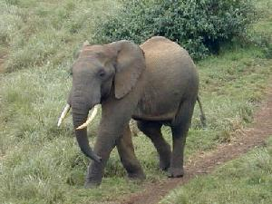

# Desafio Transfer Learning Bootcamp da DIO

## DESCRIÇÃO

O projeto consiste em aplicar o método de Transfer Learning em uma rede de Deep Learning na linguagem Python no ambiente COLAB. Neste projeto, você pode usar sua própria base de dados (exemplo: fotos suas, dos seus pais, dos seus amigos, dos seus animais domésticos, etc), o exemplo de gatos e cachorros, pode ser substituído por duas outras classes do seu interesse. O Dataset criado em nosso projeto anterior, pode ser utilizado agora.

O projeto consiste em aplicar o método de Transfer Learning em uma rede de Deep Learning na linguagem Python no ambiente COLAB. 
Para exemplo, utilizaremos o seguinte projeto que realiza Transfer Learning com o Dataset do MNIST:  
https://colab.research.google.com/github/kylemath/ml4a-guides/blob/master/notebooks/transfer-learning.ipynb
Já o dataset para download pode ser acessado por meio deste outro link:
 [Caltech101 dataset](http://www.vision.caltech.edu/Image_Datasets/Caltech101/) 

Caltech101 dataset que inclui imagens em RGB sendo 101 categorias de objetos. 
Os Arquivos trabalhados neste arquivo para o training.

<table align='center'>
<tr>
<td>
<td>
<td>
<td>
</tr>
</table>

Exemplso do Caltech101

